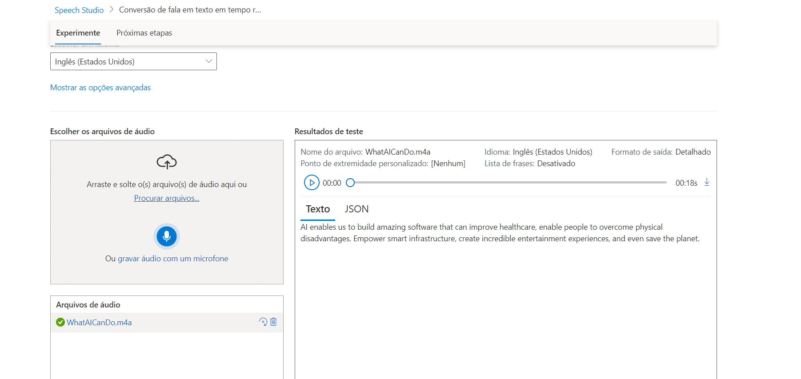
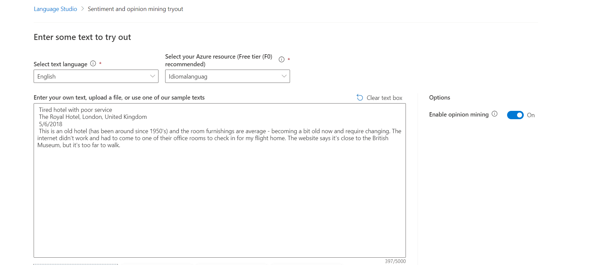
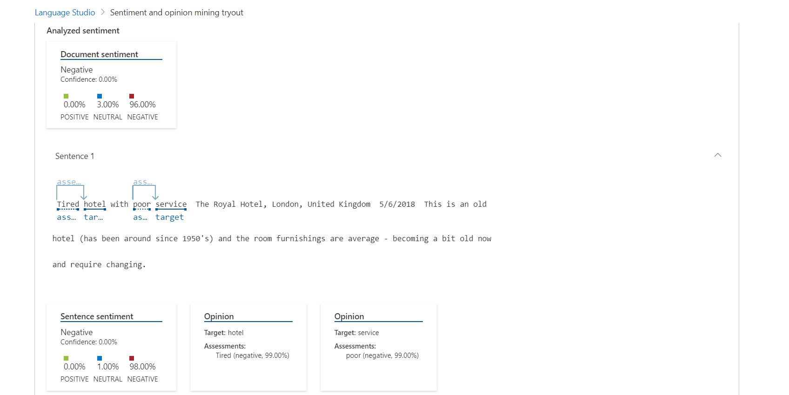
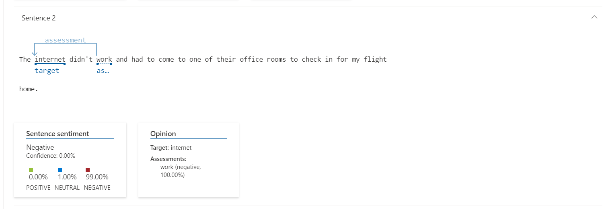
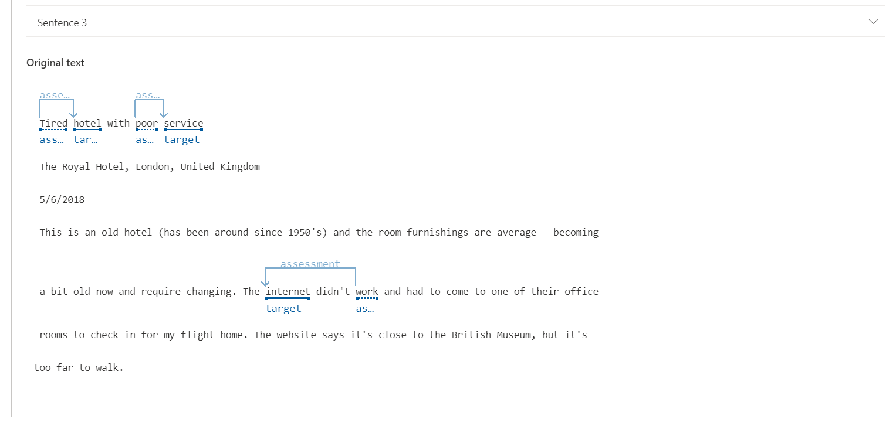
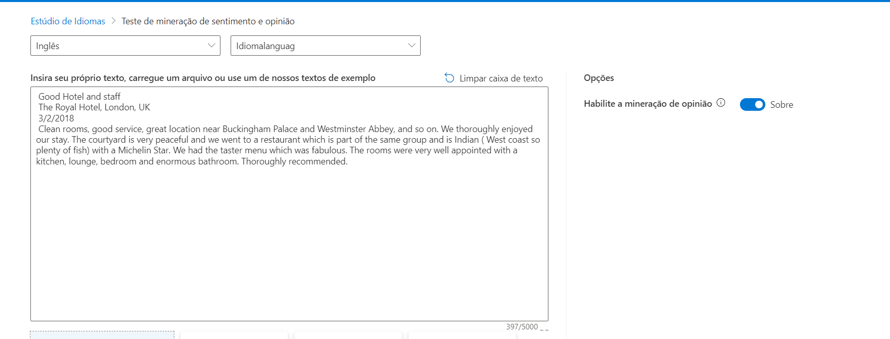
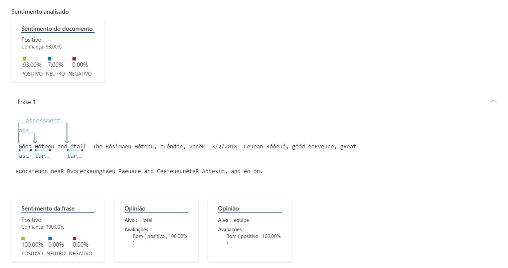
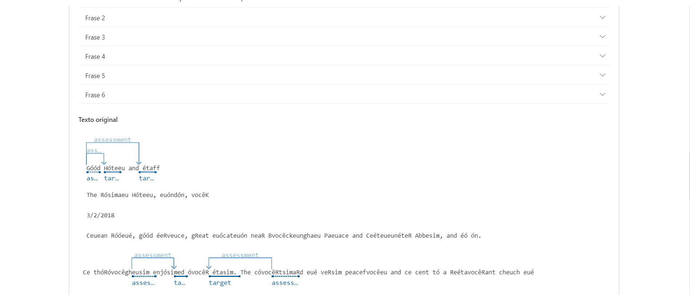

# Desafio-azure-language

* Entrei o portal Azure e criei um resurso em serviços de Idioma, para fazer a conversão de fala para texto, e esse foi o resultado. Eu inserir um audio e ele convertei para texto.

* As proximas imagens foram a analise de uma carta e a IA fez a analise de sentimento da carta, nos resultados ele mostrar a insatisfação do hotel que a pessao estava.

* As proximas imagens viram mostrar outra analise de sentimentos, porém agora positivas

essa imagens mostra que ele vai analisar frases por frases, procurando por palavras- chaves que possa ajudar na analise.

* Nesse desafio eu pude fazer conversões de fala para textos e também analise de sentimentos de textos.